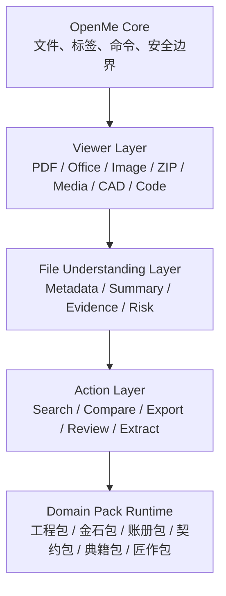

<div align="center">
  

  <br>

  <p><strong>打开文件，不必先猜该用哪个软件。</strong></p>
  <p><strong>Open Anything. Understand Everything.</strong></p>

  <p>本地优先文件工作台 · 诚实格式支持 · 可扩展能力包</p>
  <p>格物 · 开卷 · 归档 · 知新</p>

  <p>
    <a href="#快速开始">快速开始</a> ·
    <a href="#为什么是-openme">为什么是 OpenMe</a> ·
    <a href="#功能">功能</a> ·
    <a href="#架构">架构</a> ·
    <a href="#路线图">路线图</a> ·
    <a href="#english">English</a>
  </p>
</div>

<p align="center">
  
  
  
</p>

<div align="center">

<span style="color:#C91F37">━━━━━━━━━━━━━━━━━━━━━━━━━━━━━━━━━━━━</span>

</div>

## 为什么是 OpenMe

日常工作里的文件不是按软件分类来的。客户发来的可能是一份 PDF、一张表、一个压缩包、几张图片、一段视频、一个 DWG 图纸，或者一组混在一起的项目资料。

OpenMe 要解决的不是“再造一个文件查看器”，而是把文件处理变成一条清楚的路径：

```text
Open
  -> Understand
  -> Organize
  -> Act
```

| 问题 | OpenMe 的处理方式 |
| --- | --- |
| 不知道该用什么软件打开 | 先用统一工作台打开，无法高质量内置预览时交给系统程序。 |
| 不知道文件内容是否可靠 | 明确显示支持等级、格式边界和风险提示。 |
| 文件散落在多个附件里 | 以 Workspace 组织文件，而不是只打开单个文件。 |
| 行业文件需要专业理解 | 通过 Domain Packs 扩展，不把行业逻辑写死在核心里。 |
| 不希望资料默认上传 | Local First，默认本地处理，外部动作必须明确。 |

## 产品气质

OpenMe 的中国文化元素不靠装饰，而靠秩序。

| 词 | 产品含义 |
| --- | --- |
| 格物 | 先看清文件结构、格式边界和风险。 |
| 开卷 | 让文档、表格、图纸、图片、音视频先能被打开。 |
| 归档 | 把散落资料放回一个可管理的工作台。 |
| 知新 | 在文件理解层之上，进入摘要、检查、提取、比较和行动。 |

品牌色使用克制的中国红 `#C91F37`，只作为强调色，不做大面积装饰。

## 快速开始

要求：

- Windows
- Node.js 20+
- npm

```powershell
npm install
npm run electron:dev
```

构建 Windows 版本：

```powershell
npm run dist
```

常用快捷键：

| 快捷键 | 动作 |
| --- | --- |
| `Ctrl+O` | 打开文件 |
| `Ctrl+K` | 命令面板 |
| `Ctrl+S` | 保存可编辑文本/代码内容 |
| `Ctrl+W` | 关闭当前标签 |
| `Ctrl+Tab` | 切换标签 |

## 功能

| 模块 | 当前能力 | 边界 |
| --- | --- | --- |
| Workspace | 最近文件、多标签、命令面板、状态栏、能力包建议 | 项目级 Workspace 继续推进。 |
| Documents | PDF、Markdown、DOCX、纯文本、源代码 | DOCX/Markdown 属安全近似预览。 |
| Data | CSV、JSON、XLSX | XLSX 为只读数据预览，不承诺公式、宏、图表。 |
| Images | PNG、JPEG、GIF、BMP、WebP、AVIF、ICO、TIFF、SVG | SVG 隔离预览，不执行脚本。 |
| Media | MP3、WAV、OGG、M4A、AAC、FLAC、OPUS、MP4、MOV、MKV、AVI、WebM 等 | 容器识别不等于编码器全支持，失败时提供系统打开。 |
| Archives | ZIP | 内置列表、文本预览、安全解压。 |
| Books | EPUB | 安全文本阅读，不承诺复杂排版还原。 |
| Fonts | TTF、OTF、WOFF、WOFF2 | 字体试排和字号调整。 |
| Engineering | STEP、IGES、STL、OBJ、glTF、GLB、DWG、DXF | 3D 近似预览；DWG/DXF 不承诺 AutoCAD 级保真。 |
| Domain Packs | 工程包、金石包、账册包、契约包、典籍包、匠作包 | 能力包只读建议已接入，后续扩展动作入口。 |

完整边界见 [SUPPORT_MATRIX.md](SUPPORT_MATRIX.md)。

## 产品截图

当前 README 保留截图位。后续截图只放真实界面，不放概念图。

| 场景 | 目标 |
| --- | --- |
| Workspace 首页 | 展示最近文件、文件搜索、能力包建议。 |
| 多标签预览 | 展示 PDF、Excel、图片、代码等多格式并行。 |
| Media 兜底 | 展示编码器不支持时的系统打开路径。 |
| CAD 检查 | 展示 DWG/DXF 语义检查与外部原生打开边界。 |
| File Summary | 展示文件理解层输出的摘要、证据和风险。 |

## 架构



代码方向：

```text
src/
  core/              文件状态、命令、工作台、安全边界
  viewers/           各格式预览组件
  understanding/     通用元数据、摘要、证据和风险
  packs/             可选行业能力包

electron/
  ipc/               桌面与文件系统桥接
  security/          本地安全边界
  file-system/       文件读取与受保护写入
  sidecars/          CAD 等辅助引擎
```

## 能力包

OpenMe 不把行业逻辑写死在核心里。行业能力通过 Domain Packs 扩展。

| Pack | 中文名 | 状态 | 方向 |
| --- | --- | --- | --- |
| Engineering Pack | 工程包 | experimental | CAD、图层、块、实体、图纸审查。 |
| Metal Materials Pack | 金石包 | experimental | 材料牌号、规格、标准、数量、报价字段。 |
| Finance Pack | 账册包 | planned | 票据、对账、金额、日期、币种。 |
| Legal Pack | 契约包 | planned | 主体、义务、期限、条款、风险。 |
| Research Pack | 典籍包 | planned | 论文、笔记、引用、阅读摘要。 |
| Developer Pack | 匠作包 | planned | 代码树、依赖、脚本、配置。 |

## 支持等级

| 等级 | 含义 |
| --- | --- |
| 完整内置浏览 | OpenMe 可在本地按已声明能力打开和检查该格式。 |
| 高保真浏览 | 常见文件渲染接近原格式，但不承诺高级编辑或复杂布局能力。 |
| 安全近似预览 | 能提取或展示有用内容，但不承诺源软件级一致性。 |
| 语义检查 | 能检查结构、元数据或文本，但视觉输出可能不完整。 |
| 外部打开 | 调用系统默认或专业软件打开，不声明内置预览。 |
| 实验性 | 已在部分样本可用，但需要更多回归样本。 |

### 音视频边界

OpenMe 会识别更多音视频容器，但保持保守承诺：

- 能识别扩展名，不等于所有编码都能播放。
- H.264、AV1、HEVC、ProRes、旧式 WMV/AVI 编码取决于 Electron、Chromium 与系统环境。
- 播放失败时显示编码边界，并提供系统程序打开。

### DWG / DXF 边界

DWG 是封闭且版本复杂的格式。OpenMe 可以提供：

- 快速结构检查
- 图层、块、实体和文字摘要
- 近似工程预览
- 检测并调用已安装的原生 CAD 软件

OpenMe 不承诺 AutoCAD 级字体、标注、代理对象、布局和复杂实体保真。生产签审和精确编辑应使用原生 CAD 软件。

## 路线图

| 阶段 | 主题 | 目标 |
| --- | --- | --- |
| V0.1 | Open Files | 稳定打开、预览、搜索和管理最近文件。 |
| V0.2 | Understand Files | 统一 FileSummary、证据、风险和支持等级。 |
| V0.3 | Project Workspace | 把多个相关文件组织成一个工作上下文。 |
| V0.4 | Action Layer | 比较、提取、导出、审查、外部打开。 |
| V0.5 | Domain Packs | 工程、金石、账册、契约、典籍、匠作。 |
| V1.0 | File Workspace Platform | 本地优先、可扩展、可审计的文件工作平台。 |

## 质量门

每个公开版本至少满足：

- `npm run build` 通过。
- README、UI 文案与 [SUPPORT_MATRIX.md](SUPPORT_MATRIX.md) 一致。
- 不把实验性 CAD 预览描述成工业级保真。
- 不把音视频容器识别描述成全编码器支持。
- 不提交 `node_modules`、`dist`、`release`、本地 SDK、API Key 或客户样本文件。
- ZIP、SVG、Office、EPUB 等高风险内容保持隔离或清洗。
- 源文件默认不被静默修改。

## 文档

| 文件 | 用途 |
| --- | --- |
| [ROADMAP.md](ROADMAP.md) | 平台路线图与版本方向。 |
| [ARCHITECTURE.md](ARCHITECTURE.md) | Core、Viewer、Understanding、Pack 架构。 |
| [SUPPORT_MATRIX.md](SUPPORT_MATRIX.md) | 格式支持等级与能力边界。 |
| [docs/brand.md](docs/brand.md) | 品牌、颜色、Logo、文案规范。 |
| [docs/design-system.md](docs/design-system.md) | UI 设计系统与组件原则。 |
| [AGENTS.md](AGENTS.md) | 工程记录、约束、验证结论和 agent 指令。 |

## 安全与隐私模型

- 文件默认保留在本地。
- 除非用户明确启用外部或 AI 辅助动作，否则不应上传文件。
- HTML、SVG、Office、EPUB、压缩包内容必须隔离或清洗。
- ZIP 解压必须防路径穿越和大包滥用。
- 源文件不能被静默修改。
- CAD 修改必须遵循：检查 -> 生成计划 -> 用户确认 -> 另存副本 -> 校验。

## 技术栈

- Electron + React + TypeScript + Vite
- PDF.js, Mammoth, JSZip, read-excel-file
- Monaco Editor, Three.js, OCCT Import JS
- LibreDWG Web / ACadSharp auxiliary CAD pipeline

## English

OpenMe is a local-first desktop file workspace for opening, previewing, understanding, organizing and acting on everyday work files.

It is not a single-format viewer and not a single-industry tool. The core remains general. Domain-specific intelligence is added through optional packs.

```text
Open
  -> Understand
  -> Organize
  -> Act
```

Built in Wuxi, China.

## License

OpenMe original code is released under the [MIT License](LICENSE). Third-party components remain subject to their respective licenses; review CAD-related licensing requirements before redistribution.

<div align="center">

<span style="color:#C91F37">━━━━━━━━━━━━━━━━━━━━━━━━━━━━━━━━━━━━</span>

Designed and built in Wuxi, China.

</div>
