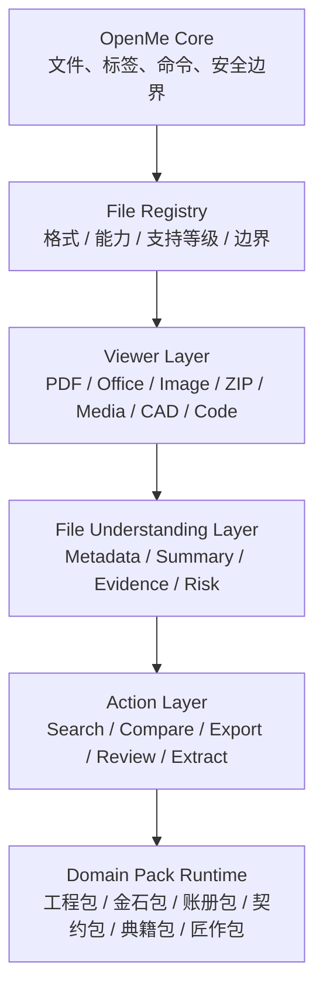

<div align="center">
  

  <br>

  

  <br>
  <br>

  

  <p><strong>打开文件，不必先猜该用哪个软件。</strong></p>
  <p><strong>Open Anything. Understand Everything.</strong></p>

  <p>本地优先文件工作台 · 诚实格式支持 · 可扩展能力包</p>
  <p>格物 · 开卷 · 归档 · 知新</p>

  <p>
    <a href="#快速开始">快速开始</a> ·
    <a href="#baseline文件格式支持">Baseline</a> ·
    <a href="#功能">功能</a> ·
    <a href="#架构">架构</a> ·
    <a href="#路线图">路线图</a> ·
    <a href="#english">English</a>
  </p>
</div>

<p align="center">
  
  
  
  
</p>

<div align="center">
  <strong>中国无锡发起，面向全球的本地优先文件工作平台。</strong>
</div>

## 为什么是 OpenMe

日常工作里的文件不是按软件分类来的。客户发来的可能是一份 PDF、一张表、一个压缩包、几张图片、一段视频、一个 DWG 图纸，或者一组混在一起的项目资料。

OpenMe 要解决的不是“再造一个文件查看器”，而是把文件处理变成一条清楚的路径：

```text
Open
  -> Understand
  -> Organize
  -> Act
```

| 问题 | OpenMe 的处理方式 |
| --- | --- |
| 不知道该用什么软件打开 | 先用统一工作台打开，无法高质量内置预览时交给系统程序。 |
| 不知道文件内容是否可靠 | 明确显示支持等级、格式边界和风险提示。 |
| 文件散落在多个附件里 | 以 Workspace 组织文件，而不是只打开单个文件。 |
| 行业文件需要专业理解 | 通过 Domain Packs 扩展，不把行业逻辑写死在核心里。 |
| 不希望资料默认上传 | Local First，默认本地处理，外部动作必须明确。 |

## Baseline：文件格式支持

OpenMe 的 baseline 是文件格式支持。

不是简单写“支持很多格式”，而是每一种格式都进入统一注册中心：

```text
src/file-registry/formats.ts
```

每个格式必须声明：

```text
extension
name
category
capabilities
supportLevel
boundary
```

也就是说，OpenMe 的格式支持必须回答两个问题：

```text
能做到什么？
不能承诺什么？
```

当前基线覆盖文档、Office、图片、设计源文件、音视频、代码、压缩包、安装包、磁盘镜像、CAD/BIM/EDA、GIS、数据库、科学数据、AI 模型、虚拟机、字体、游戏资源、证书和邮件等常见工作场景。

支持等级采用 `A+ / A / B / C / D / E / F`，并在 StatusBar 和 File Summary 中显示。完整边界见 [SUPPORT_MATRIX.md](SUPPORT_MATRIX.md)。

## 产品气质

OpenMe 的中国文化元素不靠装饰，而靠秩序。

| 词 | 产品含义 |
| --- | --- |
| 格物 | 先看清文件结构、格式边界和风险。 |
| 开卷 | 让文档、表格、图纸、图片、音视频先能被打开。 |
| 归档 | 把散落资料放回一个可管理的工作台。 |
| 知新 | 在文件理解层之上，进入摘要、检查、提取、比较和行动。 |

品牌色使用克制的中国红 `#C91F37`。README 首屏已经使用中国红作为可见分隔与地域标识；客户端 UI 中只作为强调色，不做大面积装饰。

## 快速开始

要求：

- Windows
- Node.js 20+
- npm

```powershell
npm install
npm run electron:dev
```

构建 Windows 版本：

```powershell
npm run dist
```

运行核心测试：

```powershell
npm test
```

生成格式支持矩阵：

```powershell
npm run support:matrix
```

常用快捷键：

| 快捷键 | 动作 |
| --- | --- |
| `Ctrl+O` | 打开文件 |
| `Ctrl+K` | 命令面板 |
| `Ctrl+S` | 保存可编辑文本/代码内容 |
| `Ctrl+W` | 关闭当前标签 |
| `Ctrl+Tab` | 切换标签 |

## 功能

| 模块 | 当前能力 | 边界 |
| --- | --- | --- |
| File Registry | 统一登记扩展名、分类、能力、支持等级、边界 | README/UI 的格式声明必须映射到 Registry。 |
| Workspace | 最近文件、多标签、命令面板、状态栏、能力包建议 | 项目级 Workspace 继续推进。 |
| Documents | PDF、Markdown、DOCX、纯文本、源代码、电子书 | DOCX/Markdown 属安全近似预览。 |
| Data | CSV、TSV、JSON、GeoJSON、XLSX | XLSX 为只读数据预览，不承诺公式、宏、图表。 |
| Images | PNG、JPEG、GIF、BMP、WebP、AVIF、ICO、TIFF、HEIC、HEIF、RAW、SVG | SVG 隔离预览，不执行脚本；RAW/HEIC 依赖外部或系统能力。 |
| Media | MP3、WAV、OGG、M4A、AAC、FLAC、OPUS、MP4、MOV、MKV、AVI、WebM 等 | 容器识别不等于编码器全支持，失败时提供系统打开。 |
| Archives | ZIP、RAR、7Z、TAR、GZ、TGZ、BZ2、XZ、CAB | 当前只有 ZIP 有内置安全路径；非 ZIP 不承诺内置解压。 |
| Engineering | STEP、IGES、STL、OBJ、3MF、glTF、GLB、DWG、DXF、DGN、IFC、RVT、SolidWorks、CATIA、Gerber | 3D/CAD 多为近似预览或语义路由；不承诺源软件级保真。 |
| Packages and images | EXE、MSI、MSIX、DMG、PKG、APK、AAB、IPA、DEB、RPM、ISO、IMG、VHD、VHDX、QCOW2、VMDK | 不执行、不安装、不自动挂载、不自动启动。 |
| Specialist data | SQLite、Access、Parquet、HDF5、NetCDF、ONNX、SafeTensors、GGUF、FASTA、FASTQ | 多为识别和安全路由；不执行模型，不做科学分析承诺。 |
| Fonts | TTF、OTF、WOFF、WOFF2、EOT、TTC | 字体试排和字号调整；高级表解析未完整实现。 |
| Domain Packs | 工程包、金石包、账册包、契约包、典籍包、匠作包 | 能力包只读建议已接入，后续扩展动作入口。 |

完整边界见 [SUPPORT_MATRIX.md](SUPPORT_MATRIX.md)。

## 产品截图

当前 README 保留截图位。后续截图只放真实界面，不放概念图。

| 场景 | 目标 |
| --- | --- |
| Workspace 首页 | 展示最近文件、文件搜索、能力包建议。 |
| 多标签预览 | 展示 PDF、Excel、图片、代码等多格式并行。 |
| Media 兜底 | 展示编码器不支持时的系统打开路径。 |
| CAD 检查 | 展示 DWG/DXF 语义检查与外部原生打开边界。 |
| File Summary | 展示文件理解层输出的摘要、证据和风险。 |

## 架构



代码方向：

```text
src/
  file-registry/     格式、能力、支持等级、边界
  core/              文件状态、命令、工作台、安全边界
  viewers/           各格式预览组件
  understanding/     通用元数据、摘要、证据和风险
  packs/             可选行业能力包

electron/
  ipc/               桌面与文件系统桥接
  security/          本地安全边界
  file-system/       文件读取与受保护写入
```

## 路线图

| 阶段 | 目标 |
| --- | --- |
| V0.1 | 多格式本地打开、基础 Viewer、最近文件和多标签。 |
| V0.2 | File Registry、Support Matrix、StatusBar/File Summary 支持等级。 |
| V0.3 | 文件理解层：摘要、证据、风险、推荐动作。 |
| V0.4 | Pack SDK：让行业逻辑以能力包接入。 |
| V0.5 | Workflow：报价、合同、CAD、归档等文件任务。 |

## English

OpenMe is a local-first desktop workspace for opening, inspecting and understanding everyday files.

It starts from a strict baseline: honest file format support. Each format should map to a registry entry, a support level and an explicit boundary.

The long-term direction is:

```text
Preview -> Understand -> Workflow -> Marketplace
```
