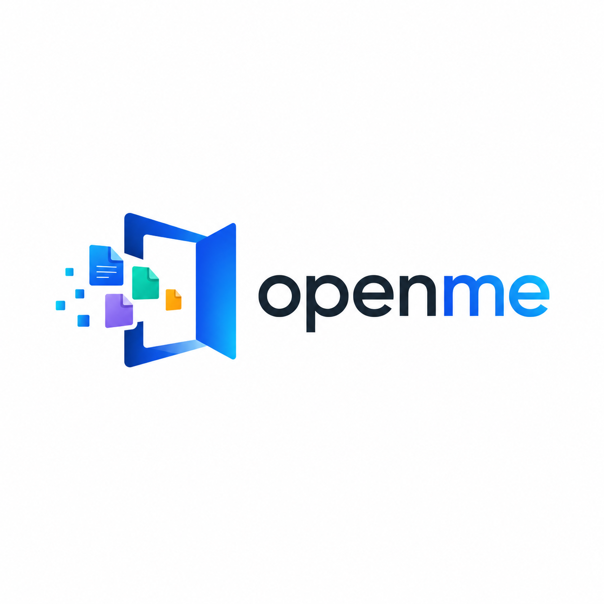
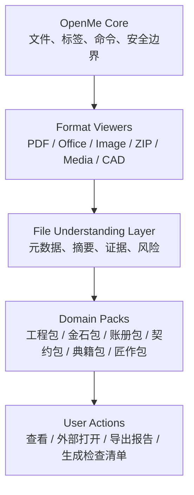

<div align="center">
  
  <h1>OpenMe</h1>
  <p><strong>打开文件，不必先猜该用哪个软件。</strong></p>
  <p>本地优先文件工作台 · 诚实格式支持 · 可扩展能力包</p>
  <p>格物、开卷、归档：把散落文件整理成可预览、可检查、可行动的工作资料。</p>

  <p>
    <a href="LICENSE"></a>
    
    
    
    
  </p>

  <p>
    <a href="#三句话理解-openme">三句话理解</a> ·
    <a href="#快速开始">快速开始</a> ·
    <a href="#功能总览">功能总览</a> ·
    <a href="#支持等级">支持等级</a> ·
    <a href="#能力包">能力包</a> ·
    <a href="#english">English</a>
  </p>
</div>

---

## 三句话理解 OpenMe

1. **OpenMe 是一个本地优先的通用桌面文件工作台**，用于打开、预览、检查和整理 PDF、Excel、Word、图片、ZIP、代码、媒体、电子书、CAD 图纸和 3D 模型。
2. **OpenMe 不把“支持格式”当口号**，而是明确区分完整浏览、高保真浏览、近似预览、语义检查、外部打开和实验性能力。
3. **OpenMe 的长期方向是 Core + Viewers + Understanding + Packs**：核心保持通用，工程、金石、账册、契约、典籍、匠作等能力通过可选能力包扩展。

> 不先问“这是什么软件的文件”，先问“这个文件能帮我把事推进到哪一步”。

## 产品气质

OpenMe 的中国文化元素不走装饰化路线，而走“器物感”和“案牍感”：

- **格物**：先看清文件结构、格式边界和风险。
- **开卷**：让文档、表格、图片、图纸、音视频先能被打开。
- **归档**：把散落资料放回一个清楚的工作台。
- **匠作**：能力包像工具匣，按行业逐步增加专门工具。

这不是给软件贴一层花纹，而是把“有据、有序、有边界”的做事方式写进产品。

## 适合谁

| 用户 | OpenMe 能解决的问题 |
| --- | --- |
| 办公与项目人员 | 快速查看混杂附件，减少应用切换。 |
| 工程与制造人员 | 初步检查图纸、模型、PDF、表格和压缩包。 |
| 财务、行政、法务 | 本地查看票据、合同、清单和附件包。 |
| 研究与学习用户 | 阅读 PDF、EPUB、笔记和资料包。 |
| 开发者 | 查看代码、配置、JSON、日志和压缩包。 |
| 行业用户 | 通过能力包识别领域字段、规则和审查清单。 |

## 不适合什么

OpenMe 不是这些软件的替代品：

- 不是 AutoCAD、SolidWorks、CAXA、浩辰、中望或 BricsCAD 的高保真替代品。
- 不是 Word、Excel、PowerPoint 的完整编辑器。
- 不是云盘、团队协作平台或文件同步工具。
- 不是默认上传文件的 AI 聊天工具。
- 不是自动修改源文件的黑箱 Agent。

OpenMe 更像一个“文件前厅”：先打开，先看懂，先判断，然后再交给正确的软件或工作流。

## 当前状态

OpenMe 处于 **early preview / 早期预览**。

当前重点：

- 本地可靠打开与预览
- 明确格式支持边界
- 高风险格式的安全预览
- 多标签、最近文件、命令面板等工作台体验
- 能力包基础架构

暂不作为重点：

- 云同步
- 账号系统
- 插件市场
- AI 直接修改源文件
- AutoCAD 级内嵌 DWG 保真

## 快速开始

要求：

- Windows
- Node.js 20+
- npm

```powershell
npm install
npm run electron:dev
```

构建 Windows 版本：

```powershell
npm run dist
```

常用快捷键：

| 快捷键 | 动作 |
| --- | --- |
| `Ctrl+O` | 打开文件 |
| `Ctrl+K` | 命令面板 |
| `Ctrl+S` | 保存可编辑文本/代码内容 |
| `Ctrl+W` | 关闭当前标签 |
| `Ctrl+Tab` | 切换标签 |

## 功能总览

| 方向 | 当前能力 | 说明 |
| --- | --- | --- |
| 工作台 | 最近文件、标签页、命令面板、快捷键、状态栏、能力包建议 | 统一入口，减少应用切换。 |
| 文档 | PDF、Markdown、DOCX、纯文本、源代码 | PDF 高保真浏览；DOCX/Markdown 安全近似预览。 |
| 数据 | CSV、JSON、XLSX | CSV/JSON 完整浏览；XLSX 只读数据预览。 |
| 图片 | PNG、JPEG、GIF、BMP、WebP、AVIF、ICO、TIFF、SVG | 位图完整浏览或依赖环境解码；SVG 安全近似预览。 |
| 压缩包 | ZIP 文件列表、文本预览、安全解压 | 防路径穿越和大包滥用。 |
| 音频 | MP3、WAV、OGG/OGA、M4A、AAC、FLAC、OPUS、WEBA、AIFF/AIF、WMA | 识别并尝试本地播放，实际解码取决于 Electron/系统。 |
| 视频 | MP4、WebM、OGV、M4V、MOV、MKV、AVI、WMV、FLV、3GP/3G2、TS、MTS、M2TS | 识别并尝试本地播放，容器支持不等于编码器全支持。 |
| 电子书 | EPUB 安全文本阅读 | 不执行书内脚本，不承诺复杂排版还原。 |
| 字体 | TTF、OTF、WOFF、WOFF2 预览 | 支持试排和字号调整。 |
| 工程文件 | STEP / IGES / STL / OBJ / glTF / GLB / DWG / DXF | 3D 近似预览；DWG/DXF 语义检查与外部原生打开路径。 |
| 能力包 | 工程包、金石包等内置 manifest 与侧边栏建议 | 已有本地推荐入口，不调用 AI、不上传文件。 |

完整边界见 [SUPPORT_MATRIX.md](SUPPORT_MATRIX.md)。

## 产品截图

> 截图位待补。建议后续放三张图：工作台首页、多标签文件预览、能力包建议卡。

```text
┌──────────────────────────────────────────────────────────────┐
│ OpenMe                                                       │
├───────────────┬──────────────────────────────────────────────┤
│ 最近文件       │  标签页：PDF / Excel / DWG / ZIP / Media      │
│ 搜索           │                                              │
│ 能力包建议     │  文件预览 + 摘要 + 支持等级 + 下一步动作       │
└───────────────┴──────────────────────────────────────────────┘
```

## 支持等级

OpenMe 不使用笼统的“支持某格式”，而是明确分级：

| 等级 | 含义 |
| --- | --- |
| 完整内置浏览 | OpenMe 可在本地按已声明能力打开和检查该格式。 |
| 高保真浏览 | 常见文件渲染接近原格式，但不承诺高级编辑或复杂布局能力。 |
| 安全近似预览 | 能提取或展示有用内容，但不承诺源软件级一致性。 |
| 语义检查 | 能检查结构、元数据或文本，但视觉输出可能不完整。 |
| 外部打开 | 调用系统默认/专业软件打开，不声明内置预览。 |
| 实验性 | 已在部分样本可用，但需要更多回归样本。 |

### 音视频边界

OpenMe 会识别更多音视频容器，但保持保守承诺：

- 能识别扩展名，不等于所有编码都能播放。
- H.264、AV1、HEVC、ProRes、旧式 WMV/AVI 编码取决于 Electron、Chromium 与系统环境。
- 播放失败时应允许用户用系统程序打开，而不是假装文件损坏。

### DWG / DXF 边界

DWG 是封闭且版本复杂的格式。OpenMe 可以提供：

- 快速结构检查
- 图层、块、实体和文字摘要
- 近似工程预览
- 检测并调用已安装的原生 CAD 软件

OpenMe **不承诺** AutoCAD 级字体、标注、代理对象、布局和复杂实体保真。生产签审和精确编辑应使用原生 CAD 软件。

## 架构



代码方向：

```text
src/
  core/              文件状态、命令、工作台、安全边界
  viewers/           各格式预览组件
  understanding/     通用元数据、摘要和证据提取
  packs/             可选行业能力包

electron/
  ipc/               桌面与文件系统桥接
  security/          本地安全边界
  file-system/       文件读取与受保护写入
  sidecars/          CAD 等辅助引擎
```

详细说明见 [ARCHITECTURE.md](ARCHITECTURE.md)。

## 能力包

OpenMe 的长期路线不是把所有行业逻辑塞进主程序，而是通过 Domain Packs 扩展。

| 能力包 | 中文名 | 状态 | 用途 |
| --- | --- | --- | --- |
| Engineering Pack | 工程包 | experimental | CAD 元数据、图层、块、实体摘要、图纸审查清单。 |
| Metal Materials Pack | 金石包 | experimental | 材料牌号、规格、标准、数量、报价字段、缺失项检查。 |
| Finance Pack | 账册包 | planned | 发票、对账单、金额、日期、币种。 |
| Legal Pack | 契约包 | planned | 合同主体、义务、期限、终止条款、风险清单。 |
| Research Pack | 典籍包 | planned | 论文、笔记、引用、阅读摘要。 |
| Developer Pack | 匠作包 | planned | 代码树、依赖、脚本、配置摘要。 |

“金石包”可以从金属材料与不锈钢场景打深，但它只是 OpenMe 的第一个深度样板，不是边界。

## 质量门

每个公开版本至少应满足：

- `npm run build` 通过。
- README、UI 文案与 [SUPPORT_MATRIX.md](SUPPORT_MATRIX.md) 一致。
- 不把实验性 CAD 预览描述成工业级保真。
- 不把音视频容器识别描述成全编码器支持。
- 不提交 `node_modules`、`dist`、`release`、本地 SDK、API Key 或客户样本文件。
- ZIP、SVG、Office、EPUB 等高风险内容保持隔离或清洗。
- 源文件默认不被静默修改。

## 路线图

| 版本 | 主题 | 目标 |
| --- | --- | --- |
| V0.1 | 可信通用工作台 | 让 OpenMe 足够可靠，可公开测试。 |
| V0.2 | Project Workspace | 把多个相关文件组织成一个工作上下文。 |
| V0.3 | File Understanding Layer | 跨格式生成通用摘要与元数据。 |
| V0.4 | Domain Pack System | 不污染核心的前提下加入行业能力。 |
| V0.5 | 第一批能力包 | 落地 Engineering 与 Metal Materials 包基础。 |
| V1.0 | 稳定平台版本 | 成为可靠的本地文件命令中心。 |

完整路线见 [ROADMAP.md](ROADMAP.md)。

## 下一步开发

优先级建议：

1. 给音视频播放失败增加“系统打开”与“可能是编码器不支持”的提示。
2. 建立 `src/understanding` 基础摘要结构。
3. 给 PDF / XLSX / ZIP / CAD 输出统一 `FileSummary`。
4. 增加公开样本库与最小回归测试。
5. 生成第一版 Windows portable 包。
6. 将能力包建议卡升级为可执行的只读动作入口。

## 仓库地图

| 文件 | 用途 |
| --- | --- |
| [ROADMAP.md](ROADMAP.md) | 平台路线图与版本方向 |
| [ARCHITECTURE.md](ARCHITECTURE.md) | Core、Viewer、Understanding、Pack 架构 |
| [SUPPORT_MATRIX.md](SUPPORT_MATRIX.md) | 格式支持等级与能力边界 |
| [AGENTS.md](AGENTS.md) | 工程记录、约束、验证结论和 agent 指令 |
| [`src/packs`](src/packs) | 能力包类型、内置 manifest 与 registry |
| [.github/ISSUE_TEMPLATE](.github/ISSUE_TEMPLATE) | bug、格式请求、能力包请求模板 |

## 贡献

欢迎聚焦的 PR、最小可复现样本和清晰 issue。

请不要上传私有、商业、客户或敏感文件。提交解析或预览问题时，尽量包含：

- 文件类型和扩展名
- 来源软件及版本
- 预期行为
- 实际行为
- 可公开的最小样本

## 安全与隐私模型

- 文件默认保留在本地。
- 除非用户明确启用外部或 AI 辅助动作，否则不应上传文件。
- HTML、SVG、Office、EPUB、压缩包内容必须隔离或清洗。
- ZIP 解压必须防路径穿越和大包滥用。
- 源文件不能被静默修改。
- CAD 修改必须遵循：检查 -> 生成计划 -> 用户确认 -> 另存副本 -> 校验。

## 技术栈

- Electron + React + TypeScript + Vite
- PDF.js, Mammoth, JSZip, read-excel-file
- Monaco Editor, Three.js, OCCT Import JS
- LibreDWG Web / ACadSharp auxiliary CAD pipeline

## 许可证

OpenMe 原始代码使用 [MIT License](LICENSE)。第三方组件遵循各自许可证；重新分发前应单独核查 CAD 相关依赖的许可证要求。

---

## English

### What OpenMe is

OpenMe is a **local-first desktop file workspace** for opening, previewing, inspecting, and organizing everyday work files in one calm interface.

It is not a single-industry tool. The core stays general. Domain-specific intelligence should live in optional packs.

```text
OpenMe Core
  -> Format Viewers
  -> File Understanding Layer
  -> Domain Packs
```

### Why it exists

Work files often arrive as a mixed pile: PDF, Excel, Word, images, ZIP archives, code, fonts, media, EPUB, CAD drawings, and 3D models. Before a user can act, they first have to guess which app can open which file.

OpenMe tries to turn that into one motion:

> Open the file. Understand the file. Decide the next action.

### Quick start

Requirements:

- Windows
- Node.js 20+
- npm

```powershell
npm install
npm run electron:dev
```

Build a Windows package:

```powershell
npm run dist
```

### Domain packs

OpenMe should grow through domain packs, not hard-coded vertical logic.

| Pack | Purpose |
| --- | --- |
| Engineering Pack | CAD metadata, layers, blocks, entity summaries, drawing review checklists |
| Metal Materials Pack | material grades, specifications, standards, quantities, quotation fields, missing-information checks |
| Finance Pack | invoices, statements, amounts, dates, currencies |
| Legal Pack | parties, obligations, deadlines, termination clauses, risk checklists |
| Research Pack | papers, notes, citations, reading summaries |
| Developer Pack | source trees, dependencies, scripts, configuration summaries |

See the Chinese section above and [ROADMAP.md](ROADMAP.md) for the full project direction.
