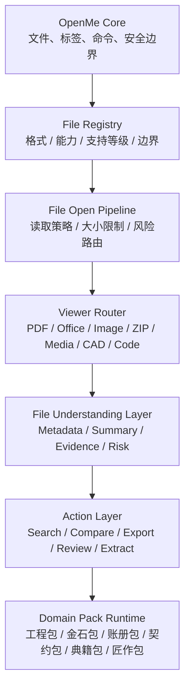

<div align="center">
  

  <br>
  <br>

  
  

  <br>
  <br>

  

  <h1>OpenMe 启吾</h1>
  <p><strong>打开文件，不必先猜该用哪个软件。</strong></p>
  <p><strong>Open Anything. Understand Everything.</strong></p>

  <p>
    <strong>本地优先文件工作台</strong> ·
    <strong>诚实格式支持</strong> ·
    <strong>可扩展能力包</strong>
  </p>

  <p>启吾 · 格物 · 开卷 · 归档 · 知新</p>

  <p>
    <a href="#格式支持基线">格式支持</a> ·
    <a href="#奢侈级不是装饰">设计原则</a> ·
    <a href="#快速开始">快速开始</a> ·
    <a href="#功能矩阵">功能矩阵</a> ·
    <a href="#架构">架构</a> ·
    <a href="#english">English</a>
  </p>
</div>

---

## 一句话

**OpenMe 启吾不是“又一个文件查看器”。它是一台本地优先的文件工作台：先识别格式，再说明边界，再选择最可靠的打开路径。**

日常工作里的文件不是按软件分类来的。客户发来的可能是一份 PDF、一张表、一个压缩包、几张图片、一段视频、一个 DWG 图纸，或者一组混在一起的项目资料。

OpenMe 启吾把这件事变成一条清楚的路径：

```text
Open -> Identify -> Preview -> Understand -> Act
```

## 奢侈级不是装饰

OpenMe 启吾的“奢侈级”不是堆渐变、动效和口号，而是四个克制原则：

| 原则 | 产品含义 |
| --- | --- |
| 材料真实 | 文件格式支持必须有边界，不写“完美兼容”。 |
| 工艺可靠 | 每个格式进入 Registry，能力和风险可追溯。 |
| 触感克制 | 中国红只作强调色，不大面积喧哗。 |
| 秩序优先 | 文件、证据、风险、动作都有固定位置。 |

“启吾”的含义不是装饰性的中文名，而是产品目标：**打开文件，也打开自己对文件的理解。**

## 格式支持基线

OpenMe 启吾的 baseline 是文件格式支持。

不是简单写“支持很多格式”，而是每一种格式都进入统一注册中心：

```text
src/file-registry/formats.ts
src/file-registry/expanded-formats.ts
```

每个格式必须声明：

```text
extension
name
category
capabilities
supportLevel
boundary
```

也就是说，OpenMe 启吾的格式支持必须回答两个问题：

```text
能做到什么？
不能承诺什么？
```

当前注册中心覆盖 **270+** 种扩展名，面向真实工作流，而不是只覆盖演示样例。

| 维度 | 覆盖范围 |
| --- | --- |
| 文档与 Office | PDF、DOC/DOCX、XLS/XLSX/XLSM、PPT/PPTX/PPTM、RTF、ODT/ODS/ODP、WPS、Pages、Numbers、Keynote |
| 图片与设计 | JPG、PNG、GIF、BMP、WebP、AVIF、TIFF、HEIC/HEIF、RAW/DNG、PSD/PSB、AI、EPS、CDR、Sketch、Figma、XD |
| 音视频 | MP3、WAV、FLAC、AAC、OGG、OPUS、M4A、WMA、AIFF、AMR、MP4、MOV、MKV、AVI、WebM、MTS/M2TS、MPEG、MXF |
| 代码与配置 | Markdown、JSON、YAML、XML、HTML/CSS、JS/TS、Python、Go、Rust、Java、C/C++、Shell、PowerShell、Docker、Terraform、GraphQL、Proto |
| 压缩与安装包 | ZIP、RAR、7Z、TAR、TAR.GZ、TAR.XZ、ZST、JAR/WAR/EAR、EXE、MSI、MSIX、APK、AAB、IPA、DEB、RPM、AppImage |
| CAD / BIM / EDA | DWG、DXF、DGN、STEP/STP、IGES/IGS、STL、OBJ、3MF、glTF/GLB、IFC、RVT/RFA、SolidWorks、CATIA、Inventor、Rhino、Gerber、KiCad、Altium、GDSII |
| 数据与科研 | SQLite、Access、Parquet、ORC、Avro、Feather、HDF/HDF5、NetCDF、MAT、FITS、NIfTI、GRIB、LAS/LAZ、GeoJSON、Shapefile、GeoPackage |
| AI 与生物信息 | ONNX、PT/PTH、CKPT、SafeTensors、GGUF、TensorFlow PB、TFLite、Core ML、NumPy、FASTA、FASTQ、SAM/BAM/CRAM、BED、GFF/GTF |
| 镜像、虚拟机、证书 | ISO、IMG、WIM、GHO、VMDK、VDI、VHD/VHDX、QCOW2、OVA/OVF、CER/CRT/PEM/PFX/P12、ICS、VCF、MBOX、EML |

支持等级采用 `A+ / A / B / C / D / E / F`，并在 StatusBar 和 File Summary 中显示。完整边界见 [SUPPORT_MATRIX.md](SUPPORT_MATRIX.md)。

## 产品气质

OpenMe 启吾的中国文化元素不靠装饰，而靠秩序。

| 词 | 产品含义 |
| --- | --- |
| 启吾 | 打开文件，也打开自己对文件的理解。 |
| 格物 | 先看清文件结构、格式边界和风险。 |
| 开卷 | 让文档、表格、图纸、图片、音视频先能被打开。 |
| 归档 | 把散落资料放回一个可管理的工作台。 |
| 知新 | 在文件理解层之上，进入摘要、检查、提取、比较和行动。 |

品牌色使用克制的中国红 `#C91F37`。README 首屏使用中国红作为可见分隔与地域标识；客户端 UI 中只作为强调色，不做大面积装饰。

## 快速开始

要求：

- Windows
- Node.js 20+
- npm

```powershell
npm install
npm run electron:dev
```

构建 Windows 版本：

```powershell
npm run dist
```

运行核心测试：

```powershell
npm test
```

生成格式支持矩阵：

```powershell
npm run support:matrix
```

常用快捷键：

| 快捷键 | 动作 |
| --- | --- |
| `Ctrl+O` | 打开文件 |
| `Ctrl+K` | 命令面板 |
| `Ctrl+S` | 保存可编辑文本/代码内容 |
| `Ctrl+W` | 关闭当前标签 |
| `Ctrl+Tab` | 切换标签 |

## 功能矩阵

| 模块 | 当前能力 | 边界 |
| --- | --- | --- |
| File Registry | 统一登记扩展名、分类、能力、支持等级、边界 | README/UI 的格式声明必须映射到 Registry。 |
| File Open Pipeline | 按类别选择读取策略，避免危险格式被主动执行或解包 | 安装包、镜像、模型、ROM 默认只识别和路由。 |
| Viewer Router | 将文件类别路由到 PDF、Office、Image、Media、CAD、Archive、Code 等 Viewer | Viewer 能力不等于源软件保真。 |
| Workspace | 最近文件、多标签、命令面板、状态栏、能力包建议 | 项目级 Workspace 继续推进。 |
| Documents | PDF、Markdown、DOCX、纯文本、源代码、电子书 | DOCX/Markdown 属安全近似预览。 |
| Data | CSV、TSV、JSON、GeoJSON、XLSX | XLSX 为只读数据预览，不承诺公式、宏、图表。 |
| Images | PNG、JPEG、GIF、BMP、WebP、AVIF、ICO、TIFF、HEIC、HEIF、RAW、SVG | SVG 隔离预览，不执行脚本；RAW/HEIC 依赖外部或系统能力。 |
| Media | 常见音频、视频和专业封装 | 容器识别不等于编码器全支持，失败时提供系统打开。 |
| Engineering | CAD、BIM、3D、EDA、PCB、GIS | 多为近似预览或语义路由；不承诺源软件级保真。 |
| Specialist data | 科学数据、AI 模型、生物信息、芯片设计 | 多为识别和安全路由；不执行模型，不做专业分析承诺。 |
| Domain Packs | 工程包、金石包、账册包、契约包、典籍包、匠作包 | 能力包只读建议已接入，后续扩展动作入口。 |

## 产品截图

当前 README 保留截图位。后续截图只放真实界面，不放概念图。

| 场景 | 目标 |
| --- | --- |
| Workspace 首页 | 展示最近文件、文件搜索、能力包建议。 |
| 多标签预览 | 展示 PDF、Excel、图片、代码等多格式并行。 |
| Media 兜底 | 展示编码器不支持时的系统打开路径。 |
| CAD 检查 | 展示 DWG/DXF 语义检查与外部原生打开边界。 |
| File Summary | 展示文件理解层输出的摘要、证据和风险。 |

## 架构



代码方向：

```text
src/
  file-registry/     格式、能力、支持等级、边界
  core/              文件状态、打开流水线、工作台、安全边界
  viewers/           各格式预览组件与 ViewerRouter
  understanding/     通用元数据、摘要、证据和风险
  packs/             可选行业能力包

electron/
  ipc/               桌面与文件系统桥接
  security/          本地安全边界
  file-system/       文件读取与受保护写入
```

## 路线图

| 阶段 | 目标 |
| --- | --- |
| V0.1 | 多格式本地打开、基础 Viewer、最近文件和多标签。 |
| V0.2 | File Registry、Support Matrix、StatusBar/File Summary 支持等级。 |
| V0.3 | 文件理解层：摘要、证据、风险、推荐动作。 |
| V0.4 | Pack SDK：让行业逻辑以能力包接入。 |
| V0.5 | Workflow：报价、合同、CAD、归档等文件任务。 |

## 本地设置

点击标题栏右侧齿轮按钮打开 **设置** 对话框。配置仅保存在本机 `localStorage`，切换即时生效。

| 设置 | 选项 |
| --- | --- |
| 主题 | 暗色 / 明亮 |
| 关闭未保存标签 | 开启 / 关闭 |
| 最近文件数量 | 10 / 25 / 50 个 |
| Tab 宽度 | 2 / 4 / 8 个空格 |
| 行号 | 显示 / 隐藏 |
| 自动换行 | 开启 / 关闭 |

设置还支持**跨设备同步**：通过设置对话框底部的 **导出 / 导入** 按钮，把当前偏好保存为 `openme-settings.v1` JSON 文件，再到另一台机器上导入即可生效。导入时会校验文件类型与版本号，不匹配会显示明确错误。

---

## English

<div align="center">
  <strong>OpenMe Qiwu</strong><br>
  A local-first luxury file workspace for opening, inspecting, routing, and understanding everyday files.
</div>

### One-line summary

**OpenMe Qiwu is not just another file viewer. It is a local-first file workspace that identifies a file, states the support boundary, and chooses the most reliable way to open it.**

Modern work does not arrive as a single clean document. A real project folder may contain a PDF, a spreadsheet, a ZIP archive, screenshots, media, DWG drawings, Office files, model files, GIS data, certificates, and domain-specific source files. OpenMe Qiwu treats those files as a workspace, not as isolated icons.

```text
Open -> Identify -> Preview -> Understand -> Act
```

### What “luxury” means here

Luxury is not decoration. In OpenMe Qiwu, it means restraint, truthful capability boundaries, and product-grade reliability.

| Principle | Product meaning |
| --- | --- |
| Material honesty | Format support must state what is supported and what is not. |
| Reliable craft | Every advertised format maps to a registry entry, support level, and boundary. |
| Restrained interface | China red is used as an accent, not as noise. |
| Ordered workflow | File identity, evidence, risk, and next actions have fixed places. |

“Qiwu” means opening the file, and more importantly, opening one’s own understanding of the file.

### Format support baseline

File format support is the product baseline.

A format claim is valid only when it is registered in:

```text
src/file-registry/formats.ts
src/file-registry/expanded-formats.ts
```

Each registered format carries:

```text
extension
name
category
capabilities
supportLevel
boundary
```

OpenMe Qiwu currently registers **270+** extensions across real-world work categories.

| Area | Coverage |
| --- | --- |
| Documents and Office | PDF, DOC/DOCX, XLS/XLSX/XLSM, PPT/PPTX/PPTM, RTF, ODT/ODS/ODP, WPS, Pages, Numbers, Keynote |
| Images and design | JPG, PNG, GIF, BMP, WebP, AVIF, TIFF, HEIC/HEIF, RAW/DNG, PSD/PSB, AI, EPS, CDR, Sketch, Figma, XD |
| Audio and video | MP3, WAV, FLAC, AAC, OGG, OPUS, M4A, WMA, AIFF, AMR, MP4, MOV, MKV, AVI, WebM, MTS/M2TS, MPEG, MXF |
| Code and configuration | Markdown, JSON, YAML, XML, HTML/CSS, JS/TS, Python, Go, Rust, Java, C/C++, Shell, PowerShell, Docker, Terraform, GraphQL, Proto |
| Archives and packages | ZIP, RAR, 7Z, TAR, TAR.GZ, TAR.XZ, ZST, JAR/WAR/EAR, EXE, MSI, MSIX, APK, AAB, IPA, DEB, RPM, AppImage |
| CAD / BIM / EDA | DWG, DXF, DGN, STEP/STP, IGES/IGS, STL, OBJ, 3MF, glTF/GLB, IFC, RVT/RFA, SolidWorks, CATIA, Inventor, Rhino, Gerber, KiCad, Altium, GDSII |
| Data and science | SQLite, Access, Parquet, ORC, Avro, Feather, HDF/HDF5, NetCDF, MAT, FITS, NIfTI, GRIB, LAS/LAZ, GeoJSON, Shapefile, GeoPackage |
| AI and bioinformatics | ONNX, PT/PTH, CKPT, SafeTensors, GGUF, TensorFlow PB, TFLite, Core ML, NumPy, FASTA, FASTQ, SAM/BAM/CRAM, BED, GFF/GTF |
| Images, VMs, certificates, mail | ISO, IMG, WIM, GHO, VMDK, VDI, VHD/VHDX, QCOW2, OVA/OVF, CER/CRT/PEM/PFX/P12, ICS, VCF, MBOX, EML |

Support levels use `A+ / A / B / C / D / E / F`. These levels are shown in the StatusBar and File Summary panel. Full support boundaries are documented in [SUPPORT_MATRIX.md](SUPPORT_MATRIX.md).

### Safety model

OpenMe Qiwu is local-first and conservative by default.

| File family | Default behavior |
| --- | --- |
| Installers and packages | Recognize and route; never install or execute automatically. |
| Scripts and build files | Preview/edit as text; never run automatically. |
| Disk and VM images | Recognize and route; never mount, boot, restore, or import automatically. |
| AI model files | Recognize and route; never execute models by default. |
| Pickle/joblib files | Recognize as risky serialized objects; never unpickle automatically. |
| CAD/BIM/EDA files | Inspect or preview only where safe; no source-application fidelity claim. |
| Media containers | Recognition does not imply codec support; fallback to system open. |

### Core architecture

```text
File Registry
  -> File Open Pipeline
  -> Viewer Router
  -> File Summary / Support Boundary
  -> Domain Packs / Workflows
```

| Layer | Role |
| --- | --- |
| File Registry | Source of truth for extension, category, capability, support level, and boundary. |
| File Open Pipeline | Chooses safe loading strategy by category and file risk. |
| Viewer Router | Routes each file category to the right built-in viewer or semantic route card. |
| File Understanding | Produces metadata, summary, evidence, warnings, and recommended actions. |
| Domain Packs | Adds industry-specific workflows without hard-coding them into core. |

### Quick start

Requirements:

- Windows
- Node.js 20+
- npm

```powershell
npm install
npm run electron:dev
```

Build a Windows distribution:

```powershell
npm run dist
```

Run tests:

```powershell
npm test
```

Generate the support matrix:

```powershell
npm run support:matrix
```

### Roadmap

| Stage | Goal |
| --- | --- |
| V0.1 | Multi-format local opening, basic viewers, recent files, and tabs. |
| V0.2 | File Registry, Support Matrix, StatusBar/File Summary support levels. |
| V0.3 | File understanding: summaries, evidence, risk, and recommended actions. |
| V0.4 | Pack SDK for domain-specific capabilities. |
| V0.5 | Workflows for quotation, contract review, CAD inspection, and archival tasks. |

### Local settings

Click the gear button in the title bar to open the **Settings** dialog. Preferences persist to `localStorage` on this device only and apply immediately.

| Preference | Options |
| --- | --- |
| Theme | Dark / Light |
| Confirm before closing tabs | On / Off |
| Recent files kept | 10 / 25 / 50 |
| Tab size | 2 / 4 / 8 spaces |
| Line numbers | Show / Hide |
| Word wrap | On / Off |

Settings also support **cross-device sync**: the **Export / Import** buttons in the Settings footer save the current preferences to an `openme-settings.v1` JSON file. Import that file on another machine to apply the same preferences. Imports validate the file type and version, and surface a typed error on mismatch.

### Direction

```text
Preview -> Understand -> Workflow -> Marketplace
```
